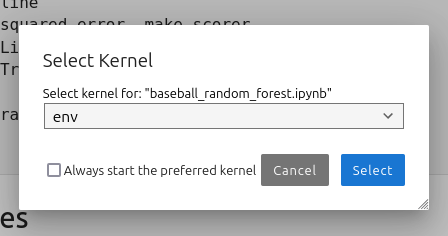
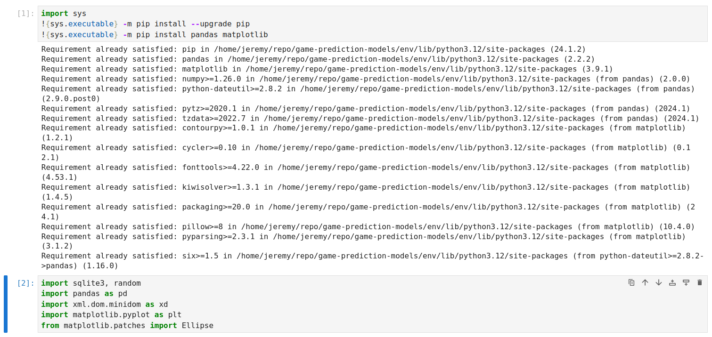

# game-prediction-models

A collection of statistical models to predict the outcomes of individual games in baseball, soccer, and basketball.

### Clone repository

Navigate to your desired directory on the terminal, then clone the project repository:

```bash
$ git clone https://github.com/hyojunm/game-prediction-models.git
```

### Install dependencies

Ensure that you have the following dependencies installed:

* [Python 3](https://www.python.org/)
* [Jupyter Lab/Notebook](https://jupyter.org/)

To run some visualizations, `graphviz` may need to be installed with:

```bash
$ sudo apt install graphviz
```

### Set up environment

1. Create a virtual environment

```bash
$ python3 -m venv [env_name]
```

2. Activate the virtual environment

```bash
$ source [env_name]/bin/activate
```

3. Install ipykernel

```bash
$ python3 -m pip install ipykernel
```

4. Create a Jupyter kernel

```bash
$ python3 -m ipykernel install --user --name=[env_name]
```

### Run the project

Start up Jupyter Lab (or Notebook) with either command:

```bash
$ jupyter lab
$ jupyter notebook
```

### Troubleshooting

* Make sure you are running your Notebook on the correct virtual environment kernel. Go to **Kernel > Change Kernel...** to verify you are using the correct kernel and/or change it to the correct one. The name should match the `[env_name]` you passed in when creating the kernel.

    

* Double check that you have installed all Python packages necessary to run the project. At the top of the Notebook file, run the appropriate cells to install and import the packages.

    